# 🗳️ **BlockVote: A Blockchain-Based Voting System**

Welcome to **BlockVote**, an innovative online voting platform powered by **Ethereum blockchain** technology, designed to provide a **secure**, **transparent**, and **decentralized** voting experience. This platform ensures **tamper-proof** elections and **immutable** results, eliminating the risks associated with traditional voting systems.

## 🌟 **Why BlockVote?**
- 🔗 **Decentralized & Transparent**: No central authority can alter or manipulate votes, ensuring the integrity of the election process.
- 🔒 **Secure & Trustworthy**: Powered by blockchain, BlockVote guarantees that all transactions (votes) are encrypted and validated.
- 📌 **Immutable Results**: Once votes are cast and counted, the results cannot be changed or tampered with.

### 🔄 **How It Works:**
1. 👨‍💼 **Admin Role**: The account that deploys the smart contract serves as the **Admin**, with the ability to add eligible voters and candidates.
2. ✅ **Voting**: Voters can cast their votes securely using their digital wallets.
3. 📊 **Results**: Once the election ends, the final results are displayed in real-time, with transparency guaranteed by blockchain.

## 💻 **Tech Stack**
- 🎨 **Frontend**: React.js
- ⛓️ **Blockchain**: Ethereum, Solidity
- 🛠️ **Development Framework**: Truffle Suite
- 🌐 **Blockchain Network**: Ganache (Local Ethereum Network)
- 👛 **Wallet Integration**: MetaMask


## 🏗️ **System Architecture**

```mermaid
graph TB
    subgraph Frontend["🖥️ Frontend Layer"]
        UI["React.js UI Components"]--"User Interaction"-->Web3["Web3.js Integration"];
        Web3--"Blockchain Interaction"-->MM["MetaMask Wallet"];
    end

    subgraph Blockchain["⛓️ Blockchain Layer"]
        Contract["Smart Contract<br/>(Voting.sol)"];
        Network["Local Network<br/>(Ganache)"];
    end

    subgraph Users["👥 User Types"]
        Admin["👨‍💼 Admin"];
        Voter["🗳️ Voter"];
    end

    MM--"Transaction Signing"-->Network;
    Network--"State Management"-->Contract;
    
    Admin--"Manages"-->Contract;
    Voter--"Casts Vote"-->Contract;

    Contract--"Election Data"-->UI;
    Contract--"Vote Results"-->UI;
```




### 🔄 Data Flow
1. Admin deploys the smart contract and manages election settings
2. Voters connect their MetaMask wallet to authenticate
3. Smart contract validates voter eligibility
4. Validated voters cast their votes through the UI
5. Votes are recorded on the blockchain
6. Results are computed and displayed in real-time

## ✨ **Key Features:**
- 🌐 **Decentralized & Transparent**: No single point of failure, ensuring fairness.
- 🛡️ **Tamper-Proof & Immutable**: All votes are recorded on a public ledger, providing trust and accountability.
- 👑 **Admin Control**: The Admin has the authority to set up elections, add candidates, and authorize voters.
- ⚡ **Real-Time Results**: Election results are immediately accessible after voting concludes.

---

## 🚀 Installation

### 📥 Step 1: Clone the Project
```bash
git clone [YOUR_REPOSITORY_URL]
```

### 🔄 Step 2: Start Ganache
Open the Ganache GUI client to start the local blockchain instance.

### ⚙️ Step 3: Compile and Deploy Election Smart Contract
```bash
truffle migrate --reset
```
We must migrate the election smart contract each time restart ganache.

### 🦊 Step 4. Configure Metamask
- Unlock Metamask
- Connect metamask to the local Ethereum blockchain provided by Ganache.
- Import an account provided by Ganache.

### 🖥️ Step 5. Run the Front End Application
```bash
cd .\client
npm install
npm start
```
Visit the URL in your browser: http://localhost:3000

## 📸 Snapshots of the BlockVote DApp

### 👨‍💼 **Admin Panel (Manage Election, Voters, Candidates)**


### 🗳️ **Voter Dashboard (View Available Elections & Vote)**


### ✅ **Vote Confirmation & Results Display (Instant & Immutable)**


